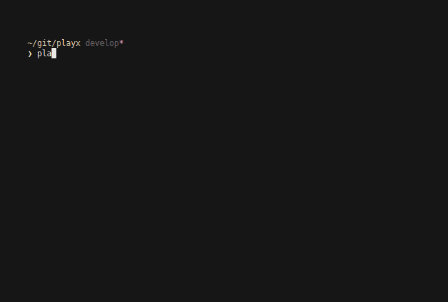
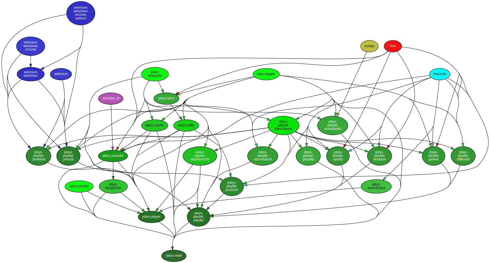

<h1 align=center>

</h1>

<div align="center">
<h1>Search and play any song from terminal.</h1>
</div>

<div align="center">
<h4>
<a href="#philosophy">Philosophy</a>&nbsp;&nbsp;&nbsp;|&nbsp;&nbsp;&nbsp;<a href="#requirements">Requirements</a>&nbsp;&nbsp;&nbsp;|&nbsp;&nbsp;&nbsp;<a href="#installation">Installation</a>&nbsp;&nbsp;&nbsp;|&nbsp;&nbsp;&nbsp;<a href="#features">Features</a>&nbsp;&nbsp;&nbsp;|&nbsp;&nbsp;&nbsp;<a href="#usage">Usage</a>&nbsp;&nbsp;&nbsp;|&nbsp;&nbsp;&nbsp;<a href="#example">Example</a>&nbsp;&nbsp;&nbsp;|&nbsp;&nbsp;&nbsp;<a href="#contributions">Contribution</a>&nbsp;&nbsp;&nbsp;|&nbsp;&nbsp;&nbsp;<a href="#to-do">To-DO</a>&nbsp;&nbsp;&nbsp;|&nbsp;&nbsp;&nbsp;<a href="#acknowledgements">Acknowledgements</a>
</h4>
</div>

# playx in action

<p align="center">

</a>
</p>

# Philosophy

Play any songs that come in your mind.
> Hoping to make it an awesome music assistant

---------

## Installation

- For Arch Linux users, it is available in AUR with the name [playx](https://aur.archlinux.org/packages/playx/).

- For others, it can be installed manually.

  __Make sure all the [dependencies](#Requirements/Dependencies) are installed.__

  Run the following command in the root directory to install playx.

  ```
  pip install -e .
  ```

  Or install using setup.py as:

  ```bash
  python setup.py install
  ```

------------

## Requirements/Dependencies

1. Python3.x

2. pip3

3. MPV

 * Get <a href = https://mpv.io/>MPV (website)</a> from here.

 * Get <a href = https://github.com/mpv-player/mpv>MPV (github)</a> from here.

4. [Chromium](https://download-chromium.appspot.com/)

> **Note**: These dependencies in linux can be installed in other variants.  
> For *arch linux*, you can use **pacman** package manager accordingly.
> Numpy is used for Markov-Chain based playlist.


------------

## Features

- play by query
- play by youtube url
- play a youtube playlist
- play a billboard chart
- play a spotify playlist
- play from soundcloud playlist
- play from JioSaavn playlist
- play from gaana playlist.
- play from local playlist
- play from Youtube Music playlist
- cache support
- CLI using `mpv`
- auto generate playlist
------------

## Usage
For now, the application is in development phase.  

```console
usage: playx [-h] [-rsearch [RSEARCH [RSEARCH ...]]] [-p] [-n] [-a] [-d] [-r] [-k] [-c] [--sync-pl PLAYLIST] [-l] [--shuffle] [--repeat [NUMBER]] [--pl-start START] [--pl-end END]
             [--level LEVEL] [--disable-file] [--list-level]
             [song [song ...]]

playx - Search and play any song that comes to your mind. If you have any issues, raise an issue in the github (https://github.com/NISH1001/playx) page

positional arguments:
  song                  Name or youtube link of song to download

optional arguments:
  -h, --help            show this help message and exit
  -rsearch [RSEARCH [RSEARCH ...]], --rsearch [RSEARCH [RSEARCH ...]]
                        Play based on terms provided
  -p, --play-cache      Play all songs from the cache. The cache is located at [~/.playx/songs/] by default
  -n, --no-cache        Don't download the song for later use.
  -a, --auto            Auto generate playlist
  -d, --skip-cached     Don't search the song in the cache.
  -r, --no-related      Disable playing related songs extracted from YouTube
  -k, --disable-kw      Disable addition of keywords while searching the song on YouTube.
  -c, --clean           Clean(fix) broken references
  --sync-pl PLAYLIST    Sync the playlists. Pass the name as arguement. If all the playlists are to be synced, just pass [All].
  -l, --lyrics          Show lyircs of the song.
  --shuffle             Shuffle the playlist in case it is one, else the option will have no effect.
  --repeat [NUMBER]     Put the passed entity on repeat , be it a playlist or a song. If an arg is not passed, infinite loop is considered. (default = Infinite)
  --pl-start START      Start position in case a playlist is passed. If passed without a playlist it has no effect.
  --pl-end END          End position in case a playlist is passed. If passed without a playlist it has no effect.

Logger:
  --level LEVEL         The level of the logger that will be used while verbosing. Use `--list-level` to check available options.
  --disable-file        Disable logging to files
  --list-level          List all the available logger levels.
```

------------

### Example
**Play by song name**
```bash
playx man sold world nirvana
```
This plays the song titled "The man who sold the world by Nirvana"  
  
**Play by youtube link**  
```bash
playx https://www.youtube.com/watch?v=4zLfCnGVeL4
```
This plays the song *The Sound of Silence*.   

**Play by soundcloud links**
```sh
playx https://api.soundcloud.com/tracks/232673157
```
This plays soundcloud [track](https://api.soundcloud.com/tracks/232673157)
  
**Play from youtube playlist**  
```bash
playx https://www.youtube.com/playlist?list=PLwg22VSCR0W6cwuCKUJSkX72xEvYXS0Zx
```
This plays the songs from my personal (and public) playlist named *Chilld and Wisdom*.

**Play from a Billboard Chart**
```sh
playx hot-100
```
This plays the songs from Billboards [hot-100](https://www.billboard.com/charts/hot-100) chart. The billboard charts can be found [here](https://www.billboard.com/charts)  

**Play from spotify playlist**
```sh
playx https://open.spotify.com/playlist/37i9dQZF1DX5Ozry5U6G0d
```
This plays the songs from Spotify [Summer Party](https://open.spotify.com/playlist/37i9dQZF1DX5Ozry5U6G0d) playlist.

**Play from soundcloud playlist**
```sh
playx https://soundcloud.com/devintracy/sets/goodafternoon
```
This plays the songs from SoundCloud [playlist](https://soundcloud.com/devintracy/sets/goodafternoon)

**Play from JioSaavn playlist**
```sh
playx https://www.jiosaavn.com/featured/magical-amit-trivedi/IGYxX3V4T7w_
```
This plays songs from the JioSaavn [playlist](https://www.jiosaavn.com/featured/magical-amit-trivedi/IGYxX3V4T7w_)

**Play from YouTube Music Playlist**
```sh
playx https://music.youtube.com/playlist?list=PL4fGSI1pDJn4pTWyM3t61lOyZ6_4jcNOw
```

This plays songs from this [playlist](https://music.youtube.com/playlist?list=PL4fGSI1pDJn4pTWyM3t61lOyZ6_4jcNOw)

**Play from local playlist**

The local playlist should have an extension ```.playx``` in order for us to recognize it as a playlist.
```sh
playx example.playx
```
This plays a playlist named example.playx

For a playlist every line is considered an entry. Refer to [example.playx](https://github.com/NISH1001/playx/blob/develop/example.playx).  
  
**Auto-Generate Playlist**
```bash
playx --auto
```
This will automatically generate a playlist by using the frequency of songs played that has been logged in the log file.  


**Term-Based Search**
```bash
playx --rsearch pink floyd
```
This will automatically generate a playlist of cached songs containing the provided terms.
  
------------

## Cache Directory Structure
By default, `playx` creates a directory in the home as `~/.playx` (which is a hidden folder). 
Structure is like:  
```bash
.playx
    |- songs/
    |- logs/
    |- playlist/
    |- playxlist/
```

*songs*: This stores all the songs downloaded by `playx`  
*logs*: This stores the log for user activities of songs that are searched and played with creation date. This will be used for recommendation of songs in future version
*playlist*: This stores all the cached playlists files.
*playxlist*: Stores all the playxlist files.

------------

## Having Issues? (We're not perfect!)

### First try cleaning the broken cache as
```bash
playx --clean
```

### See The Partial Log 
Log is found at `logs/partial_log`

### See Playlist File
Files can be found inside `playlist/`. Chances are there might be empty links or names.

### Please Create An Issue In GitHub here


------------

## Contributions
Contributions are warmly welcome. Please do go through [CONTRIBUTING](https://github.com/NISH1001/playx/blob/develop/CONTRIBUTING.md).

------------

## Module-level Dependency Graph
This is generated using [pydeps](https://github.com/thebjorn/pydeps). The codebase is kinda messy, isn't it? :D


<h1 align=center>

</h1>

------------

## TO-DO
- ~~caching of downloaded songs (if the song exists locally, play it right away else play from youtube)~~
- ~~speed up the whole **search->download->convert->play** process~~
- ~~stream/play while downloading the song~~
- ~~play all the songs from the cache~~
- ~~search lyrics~~
- ~~play from youtube playlist~~
- ~~play from local playlist (may be a list of song names)~~
- ~~play from other playlist (spotify, billboard, etc.)~~
- ~~log activity~~
- ~~auto generate playlist~~
- ~~use Markov Chains to improve auto-playlist~~
- ~~local search based on term matching~~
- use Factorization Machines to improve auto-playlist
- use logs to create simple recommendations


## Acknowledgements
- Thanks to [Deepjyoti Barman](https://github.com/deepjyoti30) for doing all the major contributions (parallelizing streaming + downloads
, playlist, logger)
- Thanks to [Mirza Zulfan](https://github.com/mirzazulfan) for logo for `playx`. It's neat (and cool)
- Thanks to [Mattwmaster58](https://github.com/Mattwmaster58) for creating packaging structure with setup file
- A good blog by Deepjyoti about copyright infringement and licensing issues we encountered for playx can be found [here](https://deepjyoti30.github.io/blog/github-and-people-who-steal).
